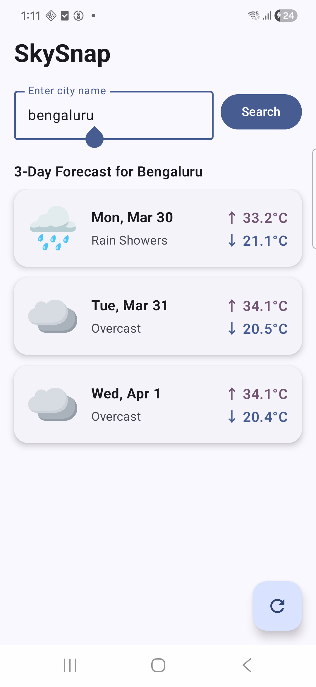
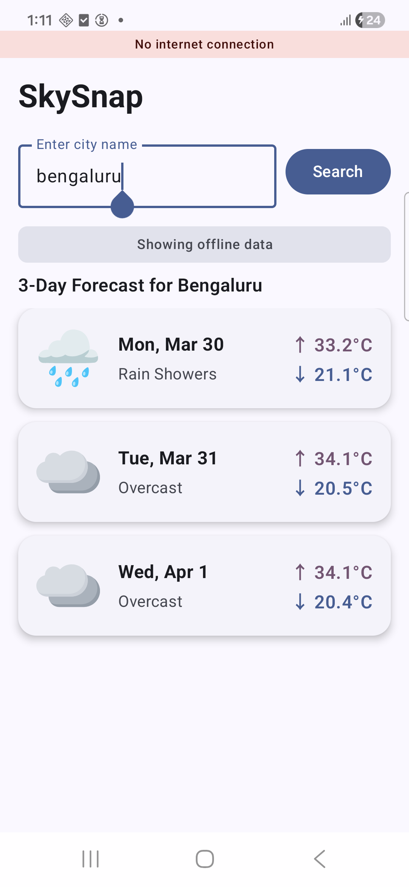
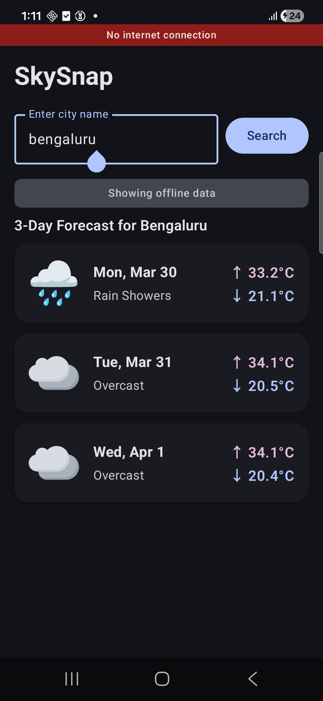
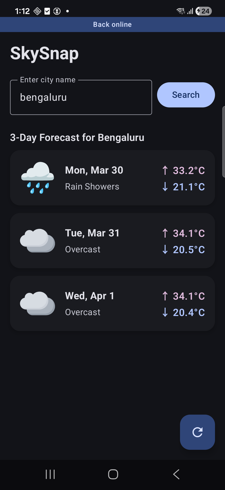

# 🌤 SkySnap
 
A simple Android weather app that displays a 3-day forecast using Open-Meteo API, with both online and offline support.
 

  
  
  
  

## 📱 Features
 
- 3-day weather forecast
- Clean Jetpack Compose based UI
- Online data fetching
- Offline caching support
- Fast and lightweight performance
 
## 🚀 Tech Stack
 
- Kotlin with Compose
- Retrofit
- Local caching (RoomDB)
- Koin for DI
 
## 🌐 API Used
 
- Open-Meteo Weather API
  - https://api.open-meteo.com/
  - https://geocoding-api.open-meteo.com/

- Docs:
  - https://open-meteo.com/en/docs/geocoding-api
  - https://open-meteo.com/en/docs

 
## 📦 How It Works
 
1. App fetches weather data from Open-Meteo API when online
2. Data is cached locally on the device
3. When offline, cached data is displayed
4. Forecast includes the next 3 days of weather

## 🎬 Demo Video

https://github.com/jeevankishorekn/WeatherApp/blob/main/docs/skysnap_demo.mp4
